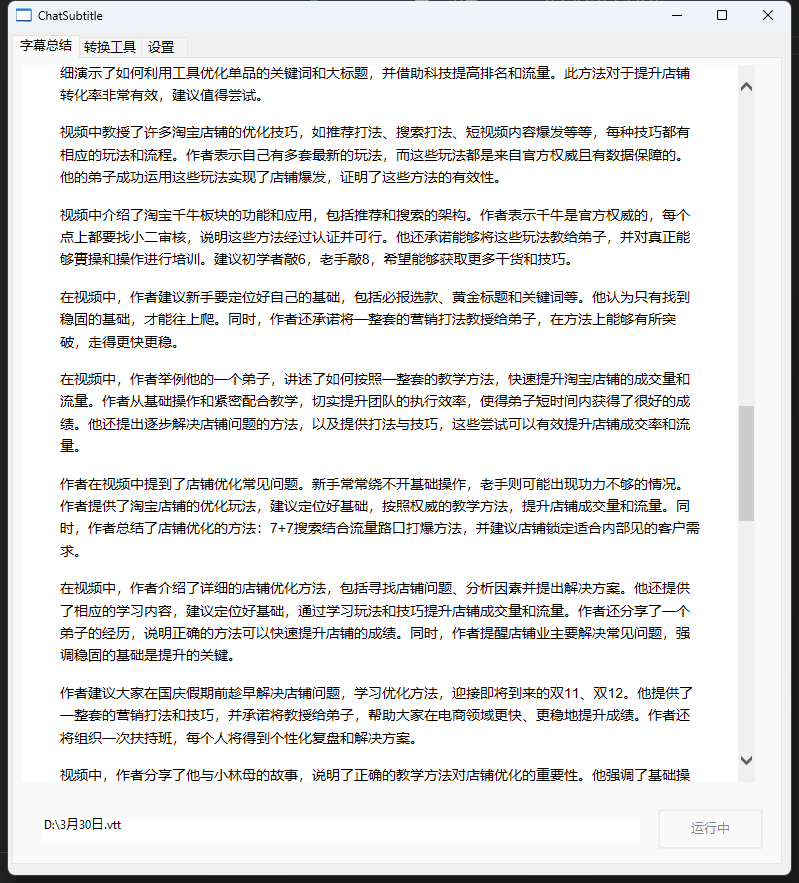
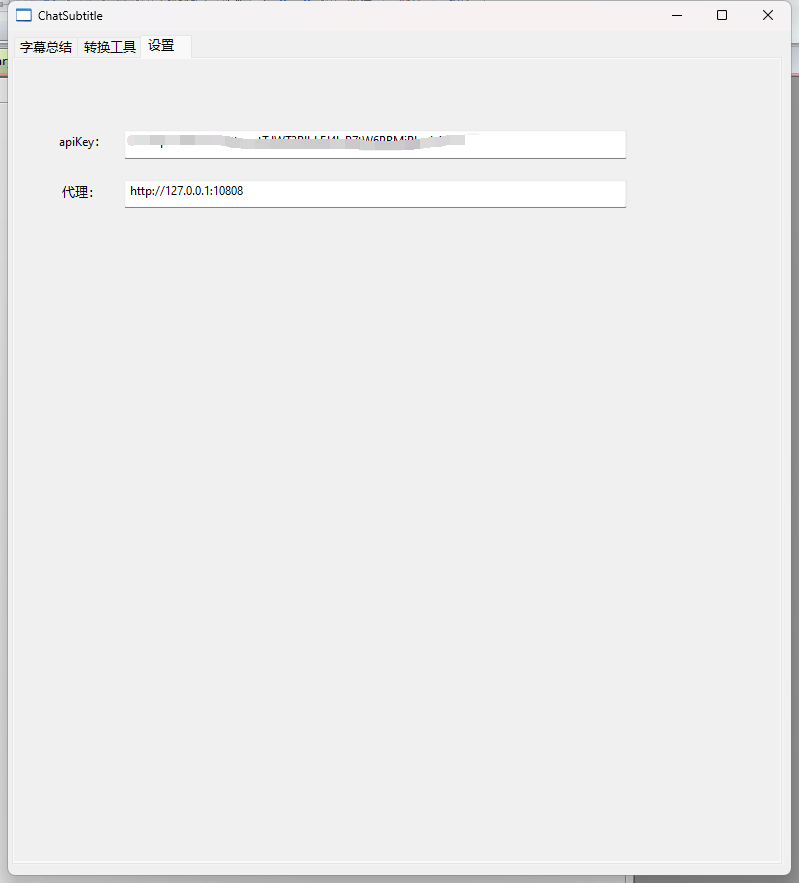
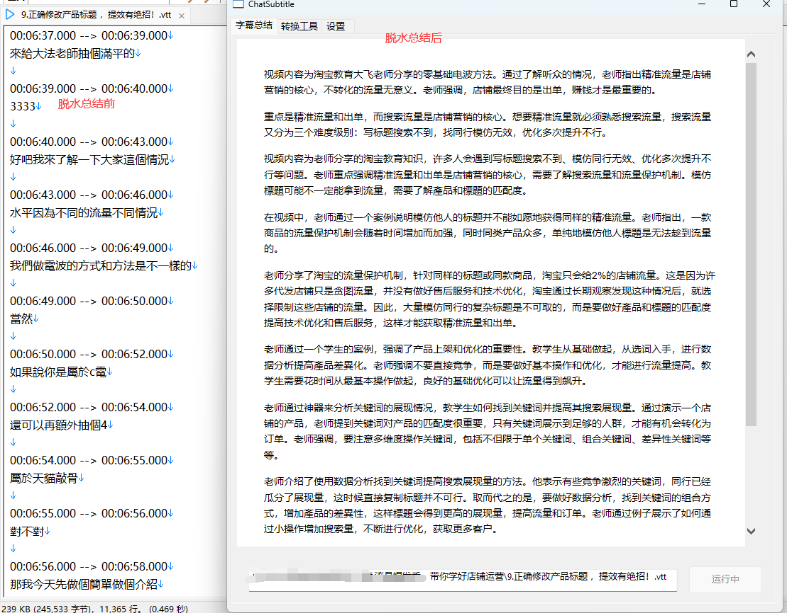

## 基于ChatGPT3.5的字幕总结去水软件
用于视频内容总结，文案优化，快速提取视频重点，提高学习和工作效率

### 优势
1. 无需配置环境，工程中包含了所有依赖，不依赖torch
2. whisper音频转文字自动调用GPU运算，2小时音频约15分钟转换完成
3. 离线AI ASR服务，白嫖语音转文本，且支持超长音频输入
4. 包含全链路工具，对无字幕视频可使用工具生成字幕
5. 精心调试的prompt，保证chatgpt回复达到预期
6. 编译文件仅5M。模型自动下载，不强制下载到c盘

### 使用方法
可在本工程`dist`目录中，下载预编译程序
#### 设置
设置标签页中填写`openai`的`apikey`和`代理`，代理支持`http`及`socks`

工具使用

如视频不自带字幕：
1. `视频提取音频`，将视频中的音频提取出来
2. `音频转字幕`,将音频转为字幕文本，低于1小时的音频推荐`ggml-small.bin`模型，高于1小时的音频推荐`ggml-medium.bin`获取更高精度识别结果。
   （已知因时序过长，超长音频在medium模型下会失序，出现异常结果，在官方版本的torch框架下存在同样问题。解决方案之一即是选择更小模型，控制输出结果。）

### 依赖
1. [编程语言aardio](https://www.aardio.com/)
2. openai
3. https://github.com/Const-me/Whisper

### 脱水成果
